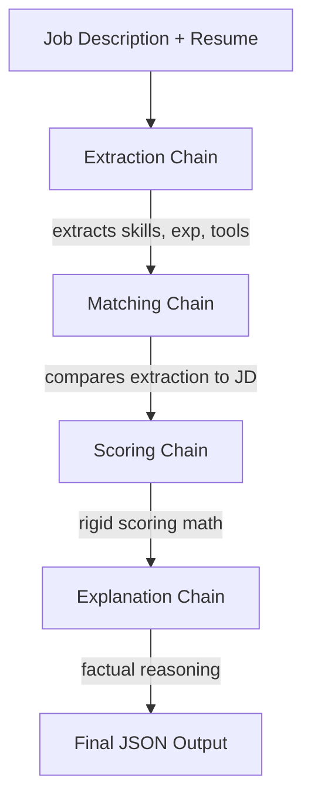

# AI Resume Screening System

## Project Overview
This project is an AI-powered Resume Screening System that evaluates candidates against a given Job Description. It uses **LangChain** to orchestrate the pipeline, **HuggingFace** models for logical processing and strict data formatting, and **LangSmith** for deep trace observation and debugging.

## Architecture Diagram
The system relies on a strict, decoupled 4-step pipeline built using LangChain Expression Language (LCEL) connected sequentially. 



**Pipeline Flow:**
Resume & JD → Extract → Match → Score → Explain → Output 

## Setup Instructions
1. Install Python 3.9+
2. Create a virtual environment and install dependencies:
   ```bash
   python -m venv venv
   source venv/Scripts/activate # On Windows
   pip install -r requirements.txt
   ```
3. Copy `.env.example` to `.env` and fill in your keys:
   - `HUGGINGFACEHUB_API_TOKEN`
   - `LANGCHAIN_API_KEY` (from your LangSmith account)

## How to Run
Execute the main script. It will sequentially evaluate the Strong, Average, and Weak synthetic resumes against the Job Description.

```bash
python main.py
```

## LangSmith Screenshot Instructions
1. Ensure `LANGCHAIN_TRACING_V2=true` in your `.env`.
2. Run `python main.py`.
3. Go to [smith.langchain.com](https://smith.langchain.com).
4. Select the `"Resume_Screening_System"` project.
5. Take a screenshot showing 3 distinct runs configured with `"strong"`, `"average"`, and `"weak"` tags.
6. Check the trace of the "Intentional Bug Sequence" to capture the incorrect output formatting, followed by the successful "Fixed Sequence" run.
